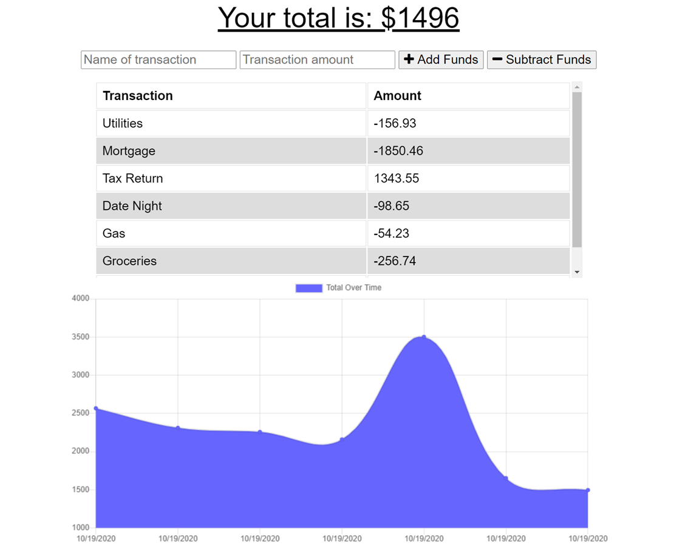

# Budget-Tracker

[Deployed Application](https://offline-budget-adder.herokuapp.com/)

## Description
As a Full-Stack Web Developer, I have created an application that will allow the user to track their withdrawals and deposits with or without a data/ internet connection. I have created this application so that their account balance is accurate when they are traveling.. In order to achieve this, I will implement MongoDB, a Service Worker, and a webmanifest..

## Table of Contents

* [Title](#Title)
* [Description](#Description)
* [Usage](#Usage)

## Usage
Enter in the name of your transaction, the transaction amount, and whether you are adding or subtracting the funds. To use the application offline, open dev tools and check "Offline" under "Application"

## Questions
Email: Coreyburkett22@gmail.com

